# SecurATS — Benutzerhandbuch

Dieses Handbuch richtet sich an alle, die mit SecurATS arbeiten: an Recruiterinnen
und Recruiter, an Führungskräfte im Fachbereich, an die Personalverwaltung. Es
setzt keine Vorkenntnisse voraus. Wer einen Computer starten und eine E-Mail
schreiben kann, kommt damit durch.

Jeder Weg ist von Anfang bis Ende beschrieben, mit einem Bild an jedem Schritt.
Sie müssen nichts auswendig lernen und nichts vorher gelesen haben.

## Ich bin neu — wo fange ich an?

| Sie sind … | Lesen Sie |
|---|---|
| Recruiterin oder Recruiter (Sie schreiben Stellen aus und betreuen Bewerbungen) | Teil 1, dann Teil 2 komplett |
| Führungskraft im Fachbereich (Sie melden Bedarf, entscheiden mit, führen Gespräche) | Teil 1, dann Weg 5 und Weg 6 |
| Personalverwaltung / HR-Leitung (Sie richten das System ein) | Teil 1 und 2, danach Teil 4 und 7 |
| Sie schauen nur zu (Rolle Viewer) | Teil 1 genügt |

> **Schreibweise:** Was Sie anklicken, steht fett und in Anführungszeichen —
> etwa **„Anmelden“**. So ist auf einen Blick klar, was Beschriftung auf dem
> Bildschirm ist und was Erklärung.

> **Hinweis zu den Bildern:** Alle Abbildungen stammen aus einer Demo-Installation
> mit erfundenen Personen. Ihre Oberfläche kann anders aussehen: Farben, Logo und
> die Wahl zwischen hellem und dunklem Erscheinungsbild legt Ihr Haus selbst fest.
> Die internen Bildschirme sind hier dunkel abgebildet, die öffentlichen Seiten
> hell — genau so, wie die Demo eingestellt ist. Anordnung und Beschriftungen
> sind dieselben.

---

# Teil 1 — Die ersten 20 Minuten

Am Ende dieses Teils haben Sie sich angemeldet, wissen, was Sie sehen, und haben
eine Bewerbung gefunden. Das reicht für den ersten Tag.

## 1.1 Anmelden

Ihre IT oder Personalverwaltung gibt Ihnen eine Internetadresse, einen
Benutzernamen und ein Passwort. Die Adresse endet auf `/recruiter/login/`.

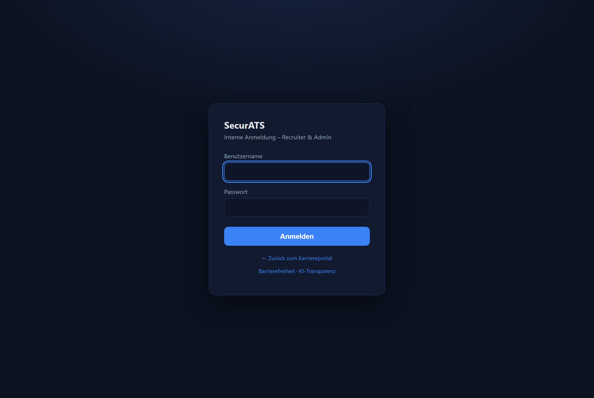

1. Benutzernamen eintippen.
2. Passwort eintippen.
3. Auf **„Anmelden“** klicken.

**Wenn es nicht klappt:** Nach fünf falschen Versuchen sperrt das System die
Anmeldung für zehn Minuten. Das ist Absicht — so kann niemand Passwörter
durchprobieren. Warten Sie die zehn Minuten ab oder lassen Sie sich von Ihrer
Personalverwaltung ein neues Passwort geben.

## 1.2 Was Sie jetzt sehen

Nach der Anmeldung landen Sie auf Ihrer Startseite.

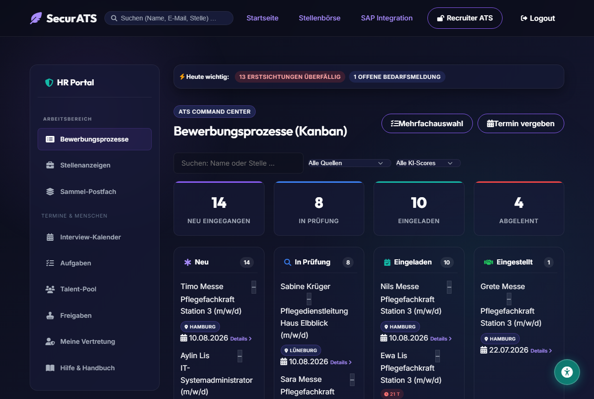

Die Seite hat drei Bereiche:

- **Ganz oben** eine Zeile mit dem Suchfeld und Ihrem Zugang zu den öffentlichen
  Seiten.
- **Links** das Menü mit allen Bereichen.
- **In der Mitte** Ihre Arbeit: die Bewerbungen, sortiert nach dem Stand des
  Verfahrens.

Über der Mitte steht eine schmale Zeile **„Heute wichtig“**. Dort erscheint nur,
was wirklich Ihre Aufmerksamkeit braucht — etwa überfällige Erstsichtungen oder
eine offene Bedarfsmeldung. Ist dort nichts, ist auch nichts zu tun.

## 1.3 Das Menü


Das Menü ist in Blöcke geteilt. Sie brauchen am Anfang nur zwei Einträge:

- **„Bewerbungsprozesse“** — Ihre Bewerbungen. Hier arbeiten Sie täglich.
- **„Stellenanzeigen“** — Ihre ausgeschriebenen Stellen.

Alles Weitere erklärt Teil 2 an der Stelle, an der Sie es zum ersten Mal
brauchen. Sie sehen im Menü nur die Bereiche, für die Sie berechtigt sind — wenn
bei Ihnen etwas fehlt, das hier abgebildet ist, hat das mit Ihrer Rolle zu tun
und ist kein Fehler.

Weiter unten steht **„Hilfe & Handbuch“**. Das ist dieser Text, jederzeit
abrufbar — und über **„Drucken“** auch als Papierheft.

## 1.4 Jemanden suchen

Sie erinnern sich an einen Namen, wissen aber nicht, auf welche Stelle sich die
Person beworben hat? Dann nehmen Sie das Suchfeld oben.


Sie können eintippen:

- einen Namen (auch nur einen Teil davon),
- eine E-Mail-Adresse,
- den Titel einer Stelle.

Die Suche zeigt nur, was Sie auch sehen dürfen. Betreuen Sie nur einen Standort,
bleiben Treffer aus anderen Standorten außen vor.

## 1.5 Am Telefon oder unterwegs

SecurATS lässt sich auch am Mobiltelefon bedienen — dieselben Inhalte, nur
untereinander statt nebeneinander.


Das Menü versteckt sich hinter dem Symbol mit den drei Strichen oben rechts.

---

# Teil 2 — Die sechs Wege durch den Alltag

Alles, was Sie regelmäßig tun, sind sechs Wege. Jeder ist hier von Anfang bis
Ende beschrieben.

## Weg 1 — Eine Stelle ausschreiben

**Ziel:** Eine neue Stelle ist veröffentlicht, und man kann sich darauf bewerben.

Öffnen Sie im Menü **„Stellenanzeigen“**.

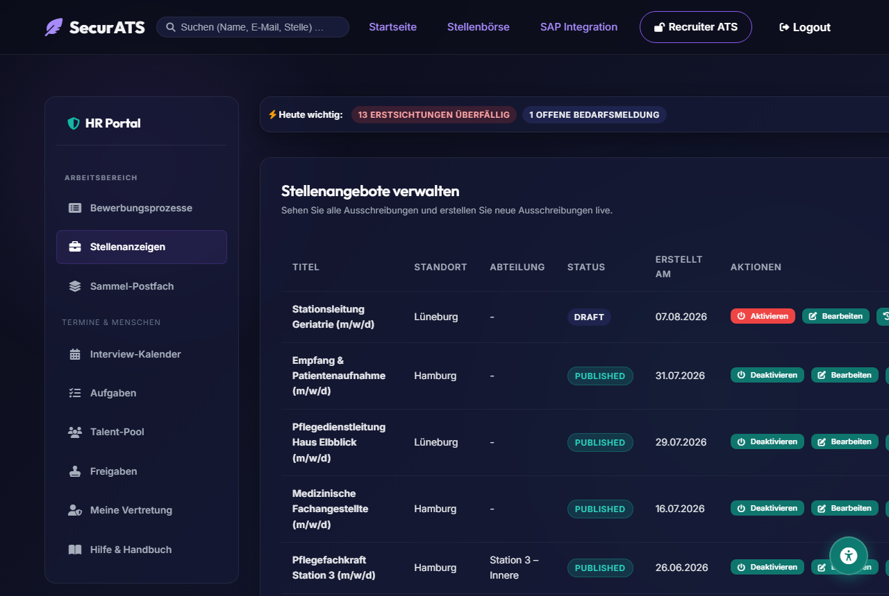

Sie sehen alle Stellen Ihres Bereichs mit ihrem Zustand und der Zahl der
Bewerbungen. Über **„Neue Stelle“** legen Sie eine an. Sie werden Schritt für
Schritt gefragt:

1. **Titel und Einrichtung** — wie die Stelle heißen soll und wo sie besetzt wird.
2. **Beschreibung und Anforderungen** — was die Person tun wird und was sie
   mitbringen muss.
3. **Gehaltsspanne** — von … bis. Ohne diese Angabe lässt sich die Stelle nicht
   veröffentlichen. Das ist keine Schikane, sondern seit der EU-Richtlinie zur
   Entgelttransparenz Pflicht: Bewerbende dürfen vorher wissen, worüber
   gesprochen wird.
4. **Fragen an die Bewerbenden** (freiwillig) — zum Beispiel: Liegt ein
   dreijähriges Examen vor? Sie können eine Frage als Pflichtkriterium markieren.
   Wer sie nicht erfüllt, bekommt eine sofortige, begründete Absage. Überlegen
   Sie hier gut: Ein Pflichtkriterium sortiert Menschen aus, ohne dass jemand
   hinsieht.

Zum Schluss **„Stellenangebot veröffentlichen“**. Die Stelle erscheint sofort
auf Ihrer Karriereseite.

> **Wenn Ihr Haus mit Freigaben arbeitet:** Dann geht die Stelle erst nach der
> Genehmigung online. Sie sehen den Stand jederzeit unter Freigaben — siehe Weg 6.

## Weg 2 — Eine Anzeige ändern oder pausieren

**Ziel:** Eine bestehende Anzeige anpassen, ohne sie neu zu schreiben.

Gehen Sie wieder auf **„Stellenanzeigen“** und klicken Sie auf die betreffende
Stelle. Sie können jederzeit:

- **Text ändern** — die Änderung ist sofort öffentlich sichtbar.
- **Pausieren** — die Anzeige verschwindet von der Karriereseite, alle bisherigen
  Bewerbungen bleiben erhalten. Nutzen Sie das, wenn genug Bewerbungen da sind,
  Sie die Stelle aber noch nicht besetzt haben.
- **Als Vorlage sichern** — dann können Sie die nächste gleichartige Stelle mit
  wenigen Klicks anlegen, statt alles neu zu tippen.

Eine Anzeige zu löschen ist nicht vorgesehen, solange Bewerbungen daran hängen.
Das schützt Ihren Nachweis: Zu jeder Bewerbung muss belegbar bleiben, worauf sie
sich bezog.

## Weg 3 — Bewerbungen sichten

**Ziel:** Sie wissen, wer sich beworben hat, und haben entschieden, wer weiter
im Verfahren bleibt.

Das Board unter **„Bewerbungsprozesse“** ist Ihr Arbeitsplatz.


**Wie das Board zu lesen ist:** Jede Spalte ist ein Schritt im Verfahren — Neu,
In Prüfung, Eingeladen, Eingestellt, Abgelehnt. Jede Karte ist eine Bewerbung.
Über den Spalten stehen die Zahlen, damit Sie auf einen Blick sehen, wo sich
etwas staut.

**Eine Bewerbung ansehen:** Klicken Sie auf die Karte. Es öffnet sich der
Steckbrief mit Anschreiben, Lebenslauf, Antworten auf Ihre Fragen und dem
bisherigen Verlauf.

**Eine Bewerbung weiterschieben:** Ziehen Sie die Karte mit der Maus in die
nächste Spalte. Wer lieber die Tastatur nutzt: Auf jeder Karte gibt es zwei
kleine Pfeil-Schaltflächen, die dasselbe tun.

**Wenn die KI-Vorbewertung eingeschaltet ist**, steht auf der Karte zusätzlich
ein Buchstabe von A bis D mit einer Begründung. Das ist eine Lesehilfe, keine
Entscheidung: Die Reihenfolge ändert sich dadurch nicht, und niemand wird
deswegen aussortiert. Steht dort, dass keine KI-Analyse möglich war, war die KI
beim Eingang der Bewerbung nicht erreichbar — sichten Sie sie einfach von Hand.

**Mehrere auf einmal:** Über **„Mehrfachauswahl“** oben können Sie mehrere Karten
zugleich markieren und gemeinsam weiterschieben oder absagen.

## Weg 4 — Mit Bewerbenden schreiben

**Ziel:** Alle offenen Fragen sind beantwortet, ohne dass Sie zwanzigmal dasselbe
tippen.

Öffnen Sie im Menü **„Sammel-Postfach“**.

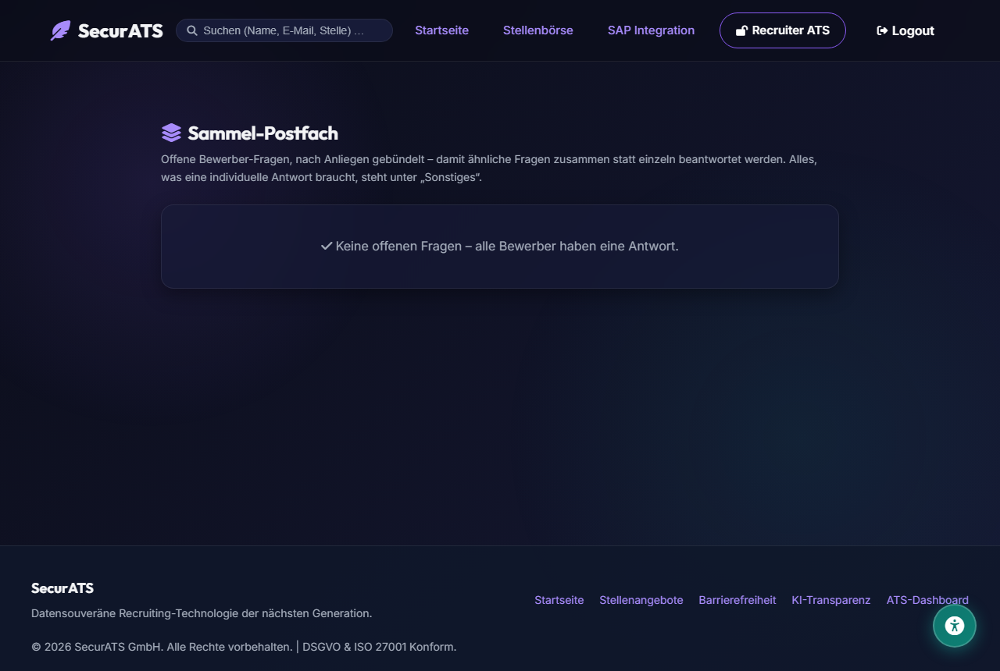

Das Postfach sortiert eingehende Nachrichten nach Anliegen, nicht nach
Eingangszeit. Alle, die nach dem Stand des Verfahrens fragen, stehen zusammen;
alle, die nach dem Termin fragen, ebenso.

**Einmal antworten, an alle senden:** Wählen Sie eine Gruppe, schreiben oder
prüfen Sie die Antwort einmal — sie geht personalisiert an jede Person einzeln
heraus. Niemand sieht, wer sie sonst noch bekommen hat.

**Textbausteine:** Für wiederkehrende Anliegen können Sie Formulierungen
hinterlegen. Das System schlägt den passenden Baustein vor; Sie ändern ihn oder
übernehmen ihn.

**Einzeln antworten** geht weiterhin: im Steckbrief der Person, Bereich
Nachrichten.

**Von sich aus alle anschreiben:** Bis hierher ging es um Antworten auf Fragen.
Manchmal wollen Sie umgekehrt beginnen — eine Einladung zum Infotag, eine
Nachricht an alle, die sich auf eine Ausbildungsstelle beworben haben. Dafür
gibt es die Serien-Nachricht: Sie öffnen die Stelle und schreiben eine Vorlage,
die je Person mit Anrede, Stellenbezeichnung und aktuellem Stand gefüllt wird.
Vor dem Senden sehen Sie die fertige Nachricht und die Empfängerliste.

Angeschrieben werden nur die **laufenden** Bewerbungen dieser Stelle.
Abgesagte und zurückgezogene bleiben außen vor — eine Einladung an jemanden,
dem Sie vorige Woche abgesagt haben, wäre schlimmer als keine Nachricht.
Jede Person erhält ihre eigene E-Mail und dieselbe Nachricht im Portal;
niemand sieht die anderen Empfänger.

## Weg 5 — Gespräche planen und bewerten

**Ziel:** Der Termin steht, alle Beteiligten wissen Bescheid, und die Eindrücke
sind festgehalten.

Öffnen Sie **„Interview-Kalender“**.

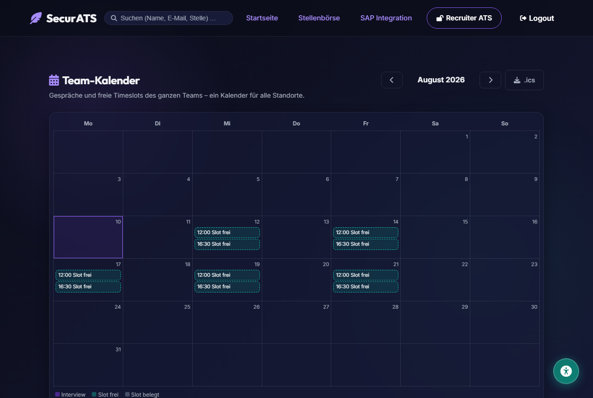

**Termin anbieten:** Legen Sie mehrere mögliche Zeitfenster an und geben Sie sie
frei. Die bewerbende Person bekommt einen Link und wählt selbst — das spart das
Hin und Her per E-Mail. Umbuchen kann sie bis 24 Stunden vorher selbst.

**Nach dem Gespräch:** Öffnen Sie den Termin und tragen Sie Ihre Einschätzung
ein. Wenn für die Stelle ein Leitfaden hinterlegt ist, hakt das System die
behandelten Themen mit ab — so fällt auf, wenn ein wichtiger Punkt nicht zur
Sprache kam.

**Warum das mehr ist als Fleißarbeit:** Nur festgehaltene Eindrücke sind später
belegbar. Wenn jemand fragt, warum eine Entscheidung so fiel, ist der Unterschied
zwischen einer Erinnerung und einem nachlesbaren Vermerk erheblich.

## Weg 6 — Entscheiden und freigeben

**Ziel:** Die Entscheidung ist getroffen, dokumentiert und — wo nötig — von den
richtigen Stellen genehmigt.

### Zusagen und Absagen

Im Steckbrief der Person wählen Sie den neuen Stand. Bei einer Absage schlägt
das System einen Text vor. Beruht die Absage auf einem Pflichtkriterium, nennt
sie diesen sachlichen Grund. Alles andere formulieren Sie selbst — und knapp und
freundlich zahlt sich aus: Menschen bewerben sich später erneut oder erzählen
weiter, wie sie behandelt wurden.

### Wenn andere mitentscheiden

Arbeitet Ihr Haus mit Genehmigungen, sehen die Beteiligten ihre offenen Vorgänge
unter **„Freigaben“**.

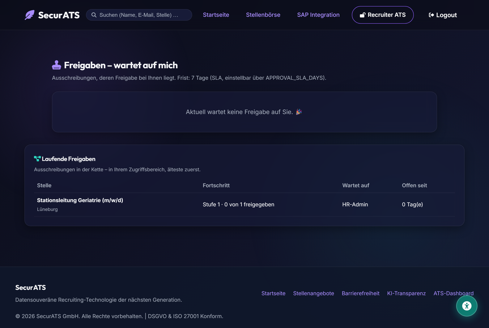

Jeder Vorgang zeigt, wer schon zugestimmt hat und wer noch fehlt. Sie können
zustimmen, ablehnen oder eine Rückfrage stellen. Der Betriebsrat hat eigene,
gesetzlich vorgegebene Widerspruchsgründe und eine Wochenfrist — beides bietet
das System an der richtigen Stelle an.

### Personalbedarf melden

Führungskräfte im Fachbereich melden neuen Bedarf hier selbst:

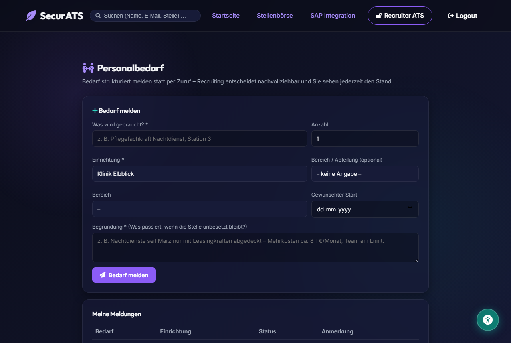

Der Vorteil gegenüber einer E-Mail: Sie sehen jederzeit, wie weit Ihre Meldung
ist, und das Recruiting hat alle Angaben beisammen, statt nachfragen zu müssen.

---

# Teil 3 — Wenn mehrere mitreden

In vielen Häusern entscheidet nicht eine Person allein. Dieser Teil erklärt die
drei Wege, auf denen andere beteiligt werden — und wie Sie erkennen, worauf ein
Vorgang gerade wartet.

## 3.1 Freigaben: wenn eine Stelle genehmigt werden muss

Manche Häuser wollen, dass eine Ausschreibung erst nach Zustimmung online geht —
etwa durch die Bereichsleitung, die Geschäftsführung oder den Betriebsrat.
Ist das eingerichtet, entsteht mit jeder Bedarfsmeldung ein Vorgang, der die
Stationen der Reihe nach durchläuft.

Die Beteiligten finden ihre offenen Vorgänge unter **„Freigaben“** (siehe Weg 6).
Wichtig zu wissen:

- **Die Reihenfolge zählt.** Eine Station wird erst gefragt, wenn die vorherige
  zugestimmt hat. Solange davor jemand fehlt, sehen Sie den Vorgang zwar, können
  aber noch nicht entscheiden.
- **Ablehnen beendet den Vorgang nicht heimlich.** Die Ablehnung mit Begründung
  geht an die antragstellende Person zurück.
- **Sie sind im Urlaub?** Dann richten Sie eine Vertretung ein (Abschnitt 3.3) —
  sonst bleibt der Vorgang liegen.

### Der Betriebsrat hat eigene Regeln

Ist eine Station als Betriebsrat eingerichtet, gilt § 99 BetrVG. Das System
setzt zwei Dinge um, die dort vorgeschrieben sind:

- **Eine Woche Zeit.** Die Frist läuft sichtbar mit.
- **Widerspruch nur mit Katalog-Grund.** Das Gesetz kennt sechs zulässige
  Gründe; genau diese bietet die Auswahl an. Ein freier Text allein genügt
  nicht — das schützt beide Seiten, denn ein Widerspruch ohne gesetzlichen
  Grund ist unwirksam.

## 3.2 Auswahlgremien: mehrere Stimmen zu einer Person

Bei manchen Stellen soll nicht eine Person allein entscheiden, wer eingeladen
oder eingestellt wird. Dafür gibt es Gremien.

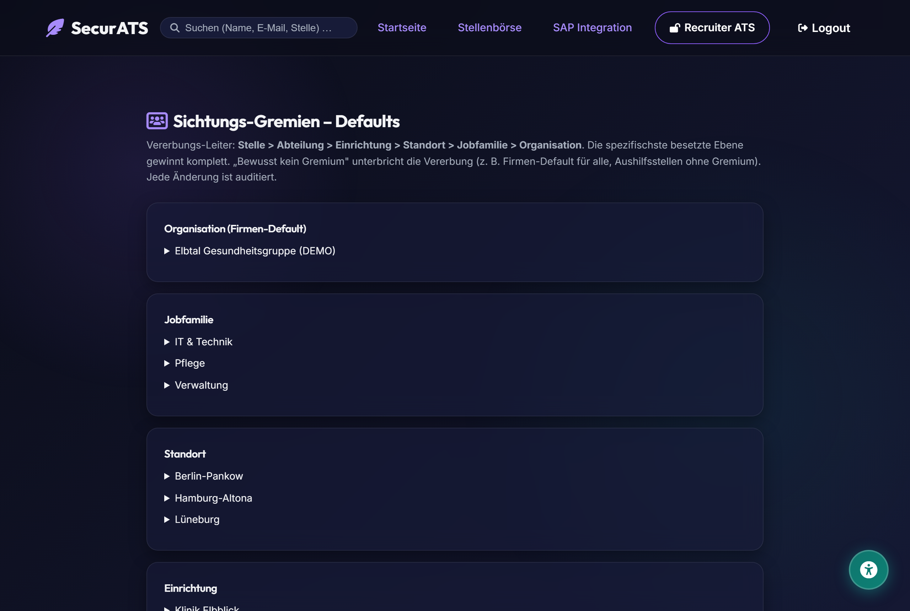

Die Personalverwaltung legt fest, wer bei welcher Art von Stelle mitstimmt.
Für die Mitglieder heißt das: Im Steckbrief einer Bewerbung erscheint eine
Abstimmung. Jede Stimme wird einzeln festgehalten — auch abweichende.

**Wer darf abstimmen?** Nur, wer namentlich in das Gremium berufen wurde. Das
gilt unabhängig von der sonstigen Rolle: Auch wer die Plattform sonst nur
einsehen darf, stimmt hier mit, wenn er oder sie benannt wurde.

## 3.3 Vertretung: wenn Sie nicht da sind

Eine Entscheidung, die drei Wochen liegen bleibt, weil jemand Urlaub hat, ist
der häufigste Grund für abgesprungene Bewerbende.

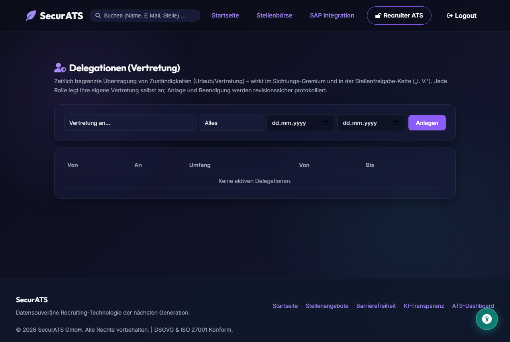

Legen Sie unter **„Meine Vertretung“** fest, wer Sie wie lange vertritt. Die
Vertretung übernimmt genau Ihre Entscheidungsbefugnisse, für den gewählten
Zeitraum, und kann auf Wunsch auf eine Einrichtung oder eine einzelne Stelle
beschränkt werden.

Zwei Dinge, die oft übersehen werden:

- **Vertretung ist keine Rolle.** Die vertretende Person braucht die Rechte,
  die sie ausüben soll — jemand, der nur einsehen darf, kann auch als
  Vertretung nichts entscheiden.
- **Jede Handlung bleibt zugeordnet.** Im Protokoll steht, wer in wessen
  Vertretung entschieden hat. Das ist kein Misstrauen, sondern die Bedingung
  dafür, dass Entscheidungen später nachvollziehbar sind.

## 3.4 Der Überblick: worauf wartet gerade was?

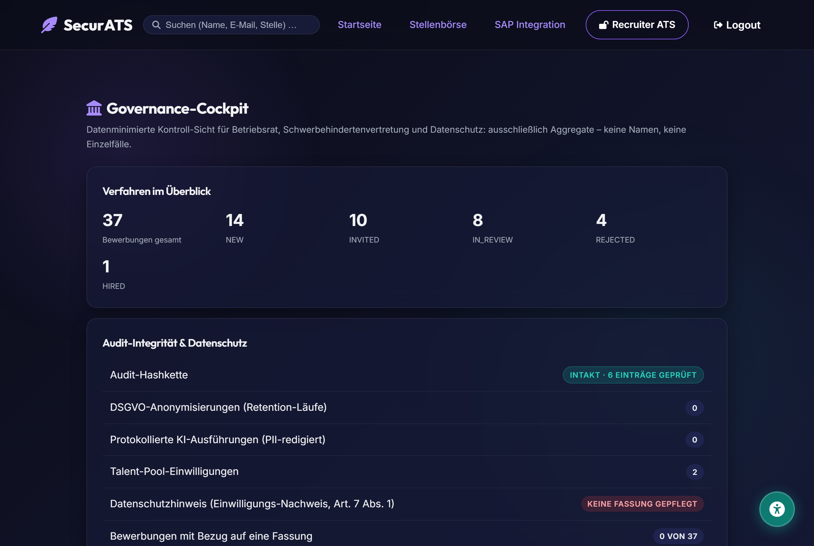

Die Seite **„Governance“** beantwortet die Fragen, die in Sitzungen gestellt
werden: Welche Vorgänge laufen? Wo hakt es? Wer hat wann entschieden? Sie ist
die Zusammenfassung all dessen, was in den Abschnitten oben einzeln passiert.

## 3.5 Schwerbehindertenvertretung

Gibt eine bewerbende Person freiwillig eine Schwerbehinderung oder
Gleichstellung an, unterrichtet das System die Schwerbehindertenvertretung —
so verlangt es § 164 SGB IX. Dafür müssen Sie nichts tun.

Drei Dinge geschehen dabei bewusst **nicht**: Die Angabe fließt nie in eine
Bewertung ein, sie steht nicht im Protokoll im Klartext, und sie wird nur
weitergegeben, wenn die Person sie ausdrücklich gemacht hat. Widerrufen kann
sie die Angabe jederzeit selbst über ihren Zugangslink.

---

# Teil 4 — Einrichten

Dieser Teil richtet sich an die **Personalverwaltung** (Rolle HR-Admin). Wer
täglich Bewerbungen betreut, braucht ihn nicht.

## 4.1 Die Einstellungs-Zentrale

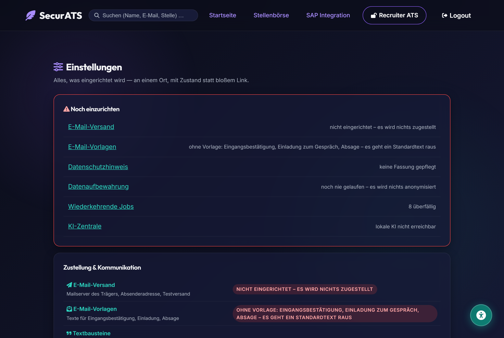

Fangen Sie hier an. Die Seite listet nicht nur die Bereiche auf, sondern zeigt
je Eintrag den **Zustand**: Was noch nicht eingerichtet ist, sagt das hier —
statt im Betrieb still auszufallen.

Die sinnvolle Reihenfolge beim Aufsetzen:

1. Standorte und Einrichtungen
2. Ansprechpartner
3. Prozessablauf
4. E-Mail-Versand
5. Entgeltbänder
6. alles Weitere nach Bedarf

## 4.2 Standorte und Einrichtungen

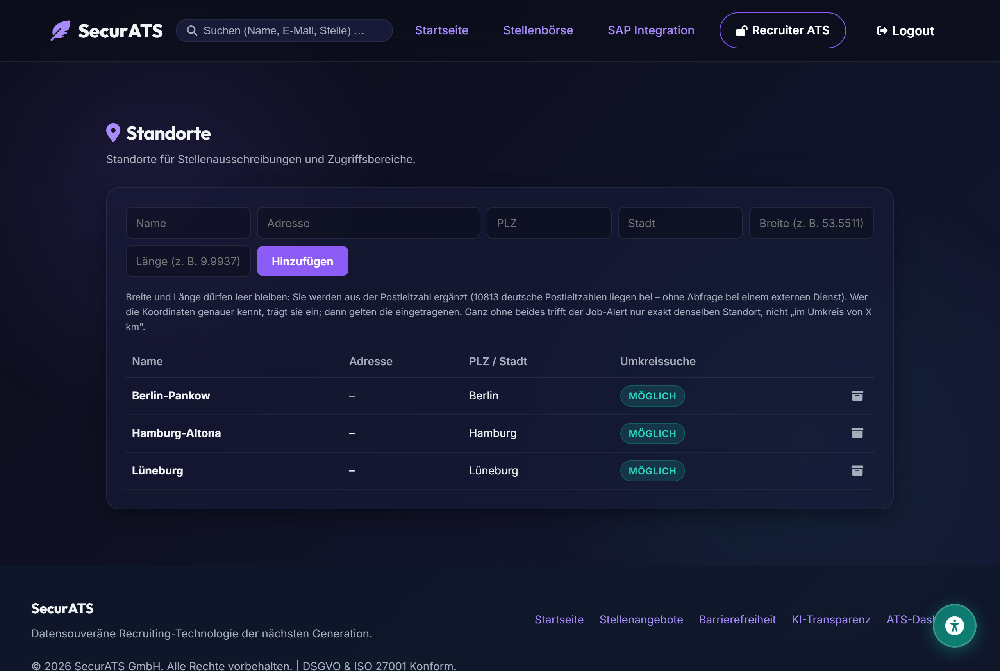

Jede Stelle gehört zu einem Standort. Tragen Sie die Postleitzahl ein — daraus
ergibt sich der Umkreis für die Stellensuche, ohne dass Adressdaten an einen
Kartendienst gehen.

## 4.3 Der Prozessablauf

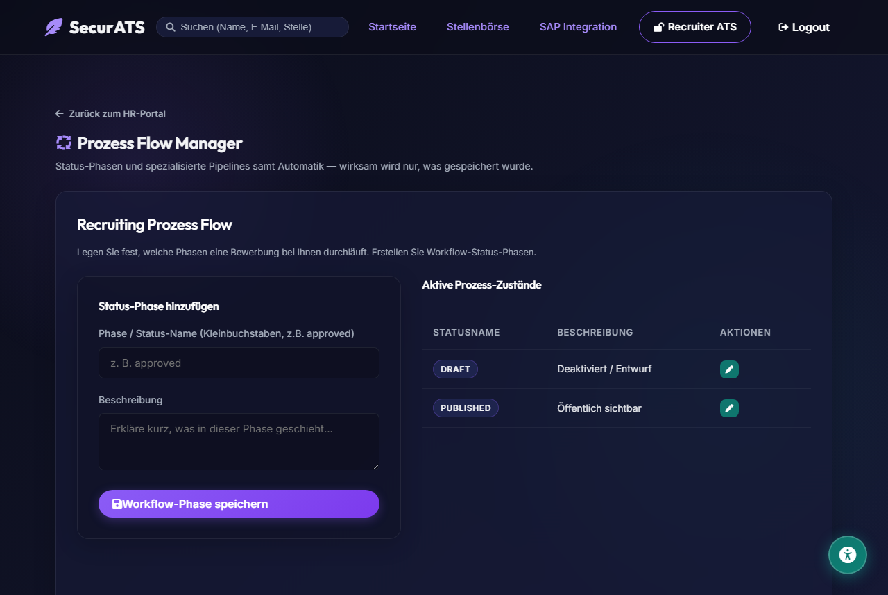

Hier legen Sie die Spalten des Boards fest — also die Schritte, die jede
Bewerbung durchläuft. Weniger ist mehr: Jede zusätzliche Station bedeutet einen
weiteren Handgriff pro Bewerbung.

Zusätzlich können Sie **Automatiken** hinterlegen: Wenn eine Bewerbung in einen
bestimmten Zustand kommt, entsteht automatisch eine Aufgabe oder geht eine
Nachricht hinaus.

## 4.4 Fragen an Bewerbende

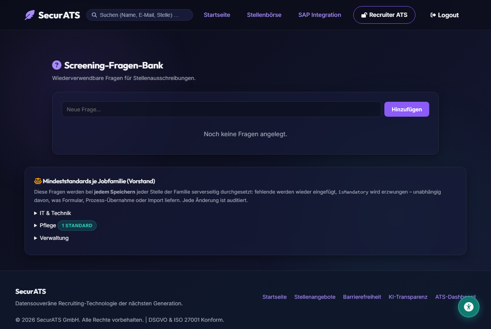

Statt jede Frage bei jeder Stelle neu zu tippen, pflegen Sie sie hier einmal.
Beim Ausschreiben wählen Recruiterinnen daraus aus.

**Pflichtkriterien mit Bedacht:** Eine Frage, die als Pflichtkriterium
markiert ist, führt bei Nichterfüllung zu einer sofortigen Absage — ohne dass
ein Mensch die Bewerbung gesehen hat. Das ist zulässig, wenn das Kriterium
sachlich für die Stelle nötig und vorher veröffentlicht ist (etwa ein
staatlich anerkanntes Examen). Alles Weichere gehört nicht in ein
Pflichtkriterium.

Bestimmte Fragen sind gesperrt: nach dem bisherigen Gehalt darf seit der
EU-Entgelttransparenzrichtlinie nicht mehr gefragt werden. Das System lässt
solche Fragen gar nicht erst zu.

## 4.5 Entgeltbänder

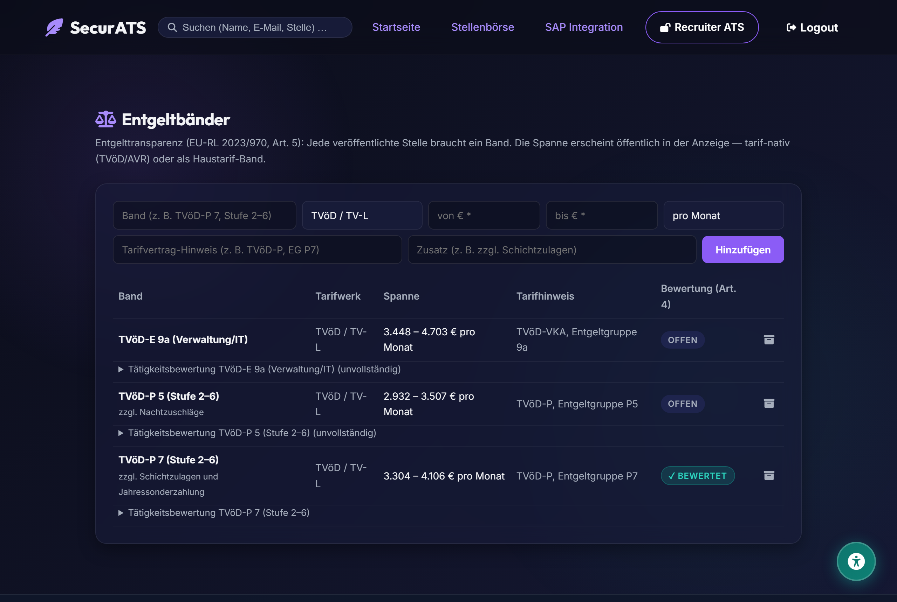

Hinterlegen Sie je Tätigkeit eine Spanne. Beim Ausschreiben wird sie
vorgeschlagen. Ohne Spanne lässt sich eine Stelle nicht veröffentlichen —
diese Pflicht kommt aus der EU-Richtlinie zur Entgelttransparenz und gilt seit
Juni 2026.

## 4.6 E-Mail-Vorlagen

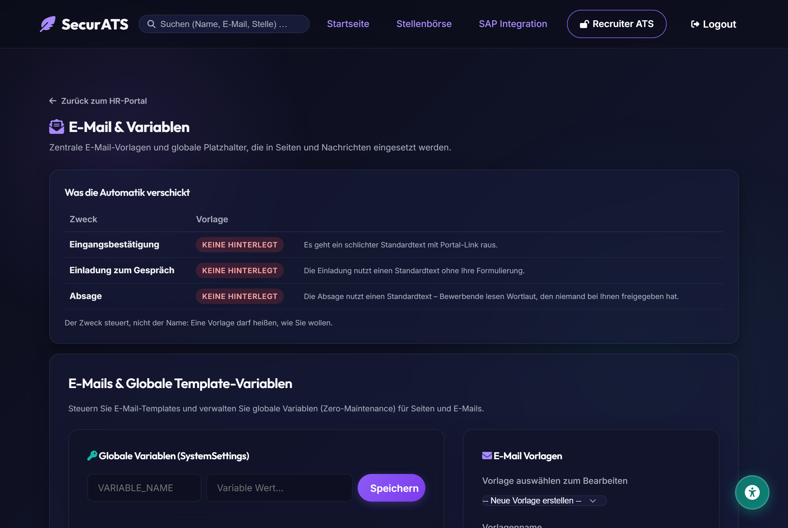

Eingangsbestätigung, Einladung, Absage: Diese Texte schreiben Sie einmal.
Platzhalter wie der Name werden beim Versand ersetzt.

## 4.7 E-Mail-Versand

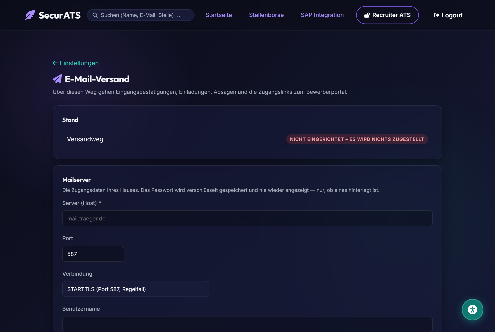

Tragen Sie hier den Mailserver Ihres Hauses ein. **Prüfen Sie die Verbindung
mit der Testfunktion** — ein falsch eingerichteter Versand fällt sonst erst
auf, wenn Bewerbende sich beschweren, dass sie nichts hören.

Bewusst kein Versanddienstleister: Bewerberdaten sollen das Haus nicht
verlassen. Das Passwort wird verschlüsselt gespeichert und nie wieder
angezeigt.

## 4.8 KI ein- oder ausschalten

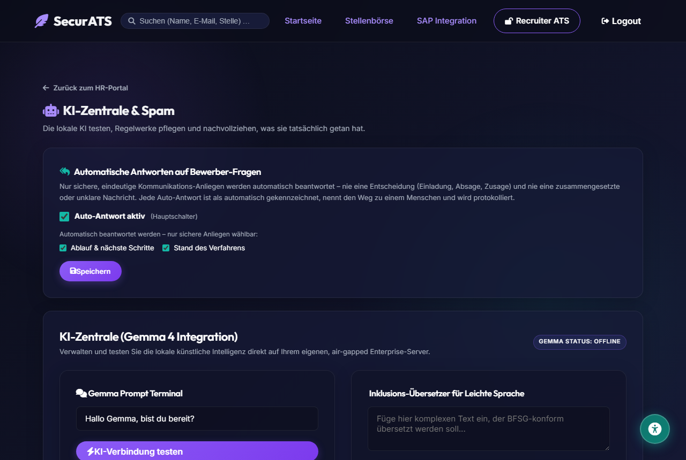

Die KI-Vorbewertung ist **im Auslieferungszustand aus**. Das ist eine bewusste
Entscheidung: Eine Einordnung von Menschen durch ein Modell soll niemand
versehentlich aktiviert haben.

Wenn Sie sie einschalten, gilt:

- Die Einordnung A bis D ist eine **Lesehilfe**. Sie sortiert nichts aus und
  lädt niemanden ein.
- Die Angabe zu einer Schwerbehinderung fließt **nie** ein.
- Schalten Sie zusätzlich **„Vorbewertung im Hintergrund berechnen“** ein, dann
  wartet die Bewerbungsseite nicht auf die KI. Dafür muss der KI-Worker laufen
  (siehe Teil 5).
- Alles läuft auf Ihrem eigenen Server. Es gehen keine Bewerbungsdaten an einen
  Anbieter.

Was Sie den Bewerbenden schulden, erledigt das System: Die öffentliche Seite
zur KI-Transparenz beschreibt genau die Funktionen, die bei Ihnen wirklich
aktiv sind (siehe Teil 6).

## 4.9 Ansprechpartner

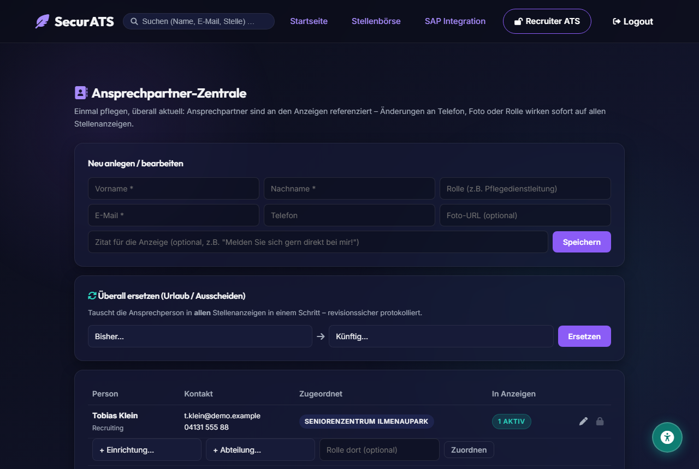

Wer auf einer Anzeige als Kontakt genannt wird, steht hier. Sie können
Ansprechpartner einer Einrichtung oder einem Bereich fest zuordnen — dann
schlägt das System sie beim Ausschreiben automatisch vor.

Diese Angaben sind bewusst **nicht verschlüsselt**: Sie stehen ohnehin
öffentlich auf der Stellenanzeige. Nehmen Sie hier also nur Menschen auf, die
damit einverstanden sind, und am besten eine Funktionsadresse statt einer
persönlichen.

## 4.10 Jobfamilien

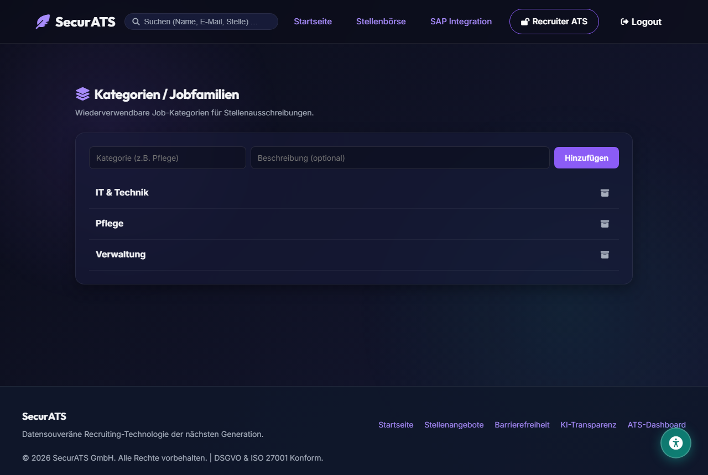

Eine Jobfamilie fasst gleichartige Tätigkeiten zusammen — „Pflege &
Betreuung“, „Verwaltung“, „IT“. Sie ist mehr als eine Sortierhilfe: An ihr
hängen die Entgeltbänder, die Pflichtfragen und die Auswertung. Legen Sie
lieber wenige, klare Familien an als viele feine.

**Mindeststandards:** Sie können je Familie Fragen hinterlegen, die in *jeder*
Stelle dieser Familie erscheinen müssen — etwa der Nachweis eines Examens in
der Pflege. Damit kann niemand versehentlich eine Stelle ohne die fachlich
zwingende Frage ausschreiben.

## 4.11 Herkunftskanäle

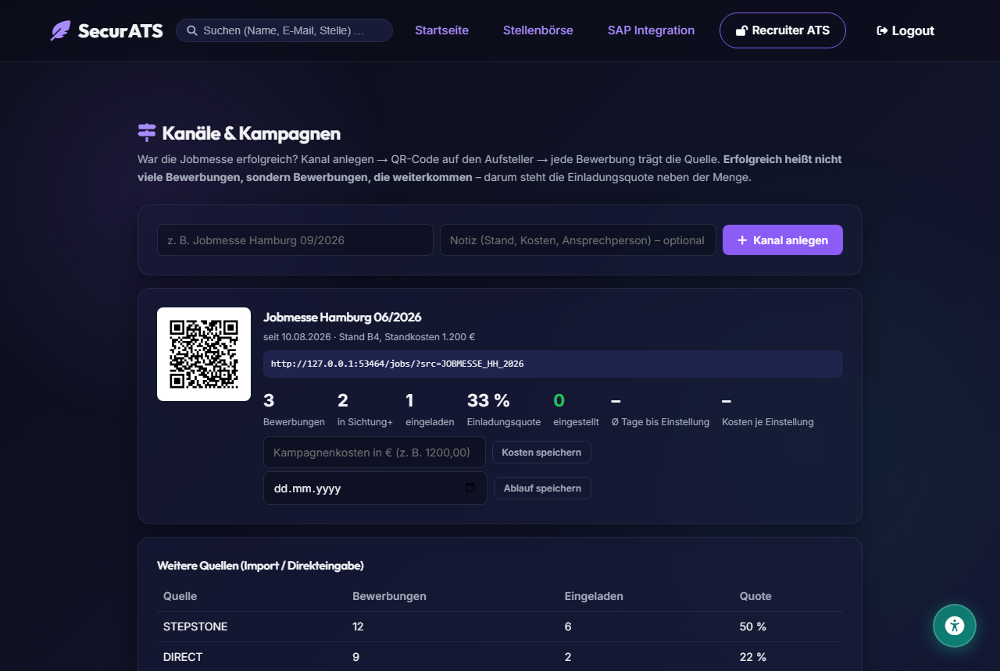

Hier pflegen Sie, über welche Wege Bewerbungen eingehen — eigene
Karriereseite, Jobbörse, Empfehlung, Aushang. Der Kanal wird bei jeder
Bewerbung mitgeführt und macht in der Auswertung sichtbar, welcher Weg sich
lohnt und welcher nur Geld kostet.

## 4.12 Stellen-Vorlagen

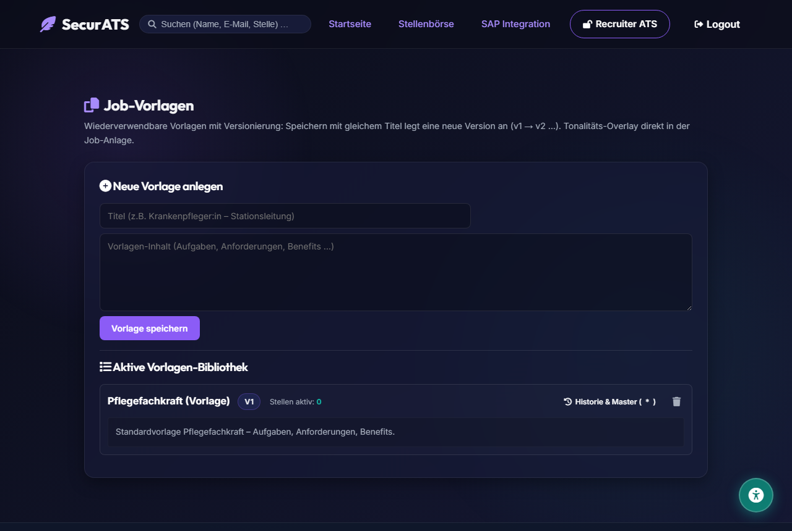

Wenn Sie dieselbe Stelle mehrmals im Jahr ausschreiben, sichern Sie sie als
Vorlage. Beim nächsten Mal übernehmen Sie Beschreibung, Anforderungen und
Fragen mit einem Klick und ändern nur, was sich unterscheidet.

## 4.13 Gesprächsformate

Telefonat, Video, Gespräch vor Ort, Probearbeiten, Assessment-Tag: Welche
Formate es bei Ihnen gibt, legen Sie selbst fest — unten auf der Seite
**„Interview-Kalender“** unter *Gesprächsformate verwalten*.

Das Format erscheint danach überall: bei der Terminvergabe, in den
Zeitfenstern zur Selbstbuchung und in der Einladung an die bewerbende Person.
Sie ist damit vorbereitet und weiß, ob sie eine Kamera braucht oder anreisen
muss.

**Beim Entfernen eines Formats** behalten bereits vereinbarte Termine ihre
Bezeichnung. Ein Gespräch, das als „Probearbeiten“ vereinbart wurde, heißt
weiter so — auch wenn Sie das Format künftig nicht mehr anbieten.

## 4.14 Datenschutzhinweis

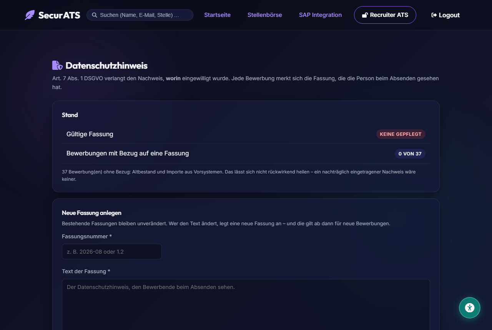

Jede Bewerbung wird mit der **Fassung** des Datenschutzhinweises verknüpft,
die zum Zeitpunkt der Bewerbung galt. Ändern Sie den Text, entsteht eine neue
Fassung; alte Bewerbungen bleiben mit ihrer verknüpft.

Warum das wichtig ist: Art. 7 Abs. 1 DSGVO verlangt den Nachweis, **worin**
eingewilligt wurde. Ein Hinweis, der heute anders lautet als vor einem Jahr,
belegt nichts über eine Bewerbung von damals.

## 4.15 Stammdaten einlesen

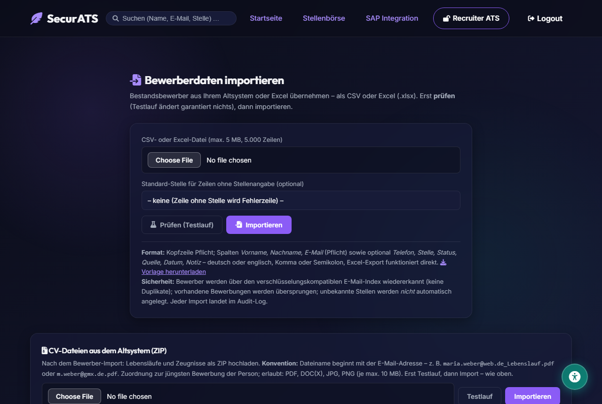

Beim Aufsetzen ersparen Sie sich Tipparbeit: Standorte, Einrichtungen und
Ansprechpartner lassen sich aus einer Tabelle einlesen. Laden Sie zuerst die
Beispieldatei herunter — sie zeigt die erwarteten Spalten.

Das Einlesen zeigt vorher an, was entstehen würde. Prüfen Sie diese Liste,
bevor Sie bestätigen.

---

# Teil 5 — Wenn etwas klemmt

Die vier Fälle, die im Betrieb tatsächlich vorkommen — und was Sie selbst tun
können.

## 5.1 Der zentrale Blick: Wiederkehrende Jobs

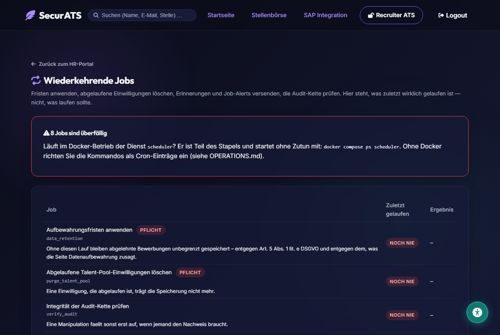

Diese Seite ist die erste Adresse, wenn etwas nicht passiert ist. Sie zeigt für
jede regelmäßige Aufgabe, **wann sie zuletzt wirklich lief** — nicht, wann sie
laufen sollte. Ein Job, der nie lief, steht als solcher da.

Steht dort etwas rot, prüfen Sie zuerst, ob der Zeitplan-Dienst läuft:

```bash
docker compose ps scheduler
```

## 5.2 Es gehen keine E-Mails raus

**Erkennen:** Bewerbende melden sich nicht, oder auf der Jobs-Seite stehen die
Versand-Jobs rot.

**Beheben:** Prüfen Sie die Verbindung unter *E-Mail-Versand* (Abschnitt 4.7).
Ist der Mailserver wieder erreichbar, holen die Jobs das Versäumte beim
nächsten Lauf nach — **fehlgeschlagene Nachrichten gehen nicht verloren**,
sondern werden wiederholt. Sie müssen nichts von Hand nachsenden.

## 5.3 Die KI antwortet nicht

**Erkennen:** In der KI-Zentrale steht der Status auf offline; auf der
Jobs-Seite zeigt der Block *KI-Warteschlange* fehlgeschlagene Aufgaben;
betroffene Bewerbungen tragen den Vermerk, dass keine Analyse möglich war.

**Beheben:**

```bash
docker compose --profile ki up -d ollama
```

Danach in der KI-Zentrale die Verbindung testen. Ist sie grün, drücken Sie auf
der Jobs-Seite **„Fehlgeschlagene erneut einreihen“** — die Bewerbungen werden
nachbewertet, der Vermerk verschwindet.

**Wichtig:** Das Sichten, Einladen und Absagen funktioniert die ganze Zeit
normal weiter. Die Einordnung ist eine Hilfe, keine Voraussetzung.

## 5.4 Bewerbungen ohne Einordnung

War die KI bei Eingang nicht erreichbar, kommt eine Bewerbung ohne Einordnung
an. Auf der Jobs-Seite steht dann, wie viele das betrifft, und ein Klick auf
**„Bewertung nachholen“** reiht sie nach.

## 5.5 Wenn gar nichts geht

Für die IT: `GET /healthz/` liefert den Gesamtzustand als Datensatz —
Datenbank, Dateiablage, KI-Erreichbarkeit, Zwischenspeicher und die Länge der
Warteschlange. Das eignet sich auch zur Überwachung.

## 5.6 Zwei Dinge vorweg, wenn etwas klemmt

Bevor Sie die Fälle oben durchgehen:

- **Sie sehen weniger als hier abgebildet.** Das liegt fast immer an Ihrer Rolle,
  nicht an einem Fehler. Wenn Sie mehr brauchen, wenden Sie sich an Ihre
  Personalverwaltung.
- **Etwas reagiert nicht.** Laden Sie die Seite neu. Bleibt es dabei, notieren Sie,
  was Sie zuletzt getan haben, und melden Sie es Ihrer IT — mit dieser Angabe kann
  sie sofort etwas anfangen.

---

# Teil 6 — Was das System für Sie erledigt

Dieser Teil ist zum Nachschlagen, wenn jemand fragt: der Datenschutzbeauftragte,
der Betriebsrat, eine Prüferin — oder eine bewerbende Person.

## 6.1 Löschfristen laufen automatisch

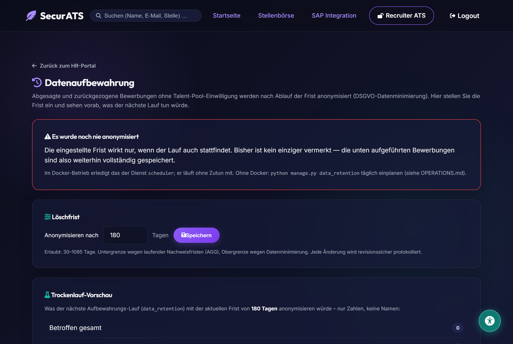

Abgelehnte Bewerbungen dürfen nicht unbegrenzt gespeichert werden (Art. 5 Abs. 1
lit. e DSGVO). Sie legen die Frist fest, das System wendet sie täglich an und
anonymisiert, was älter ist.

**Der Trockenlauf** zeigt vorher, was betroffen wäre — ohne etwas zu ändern.
Nutzen Sie ihn, bevor Sie eine Frist verkürzen.

## 6.2 Jede Entscheidung ist belegbar

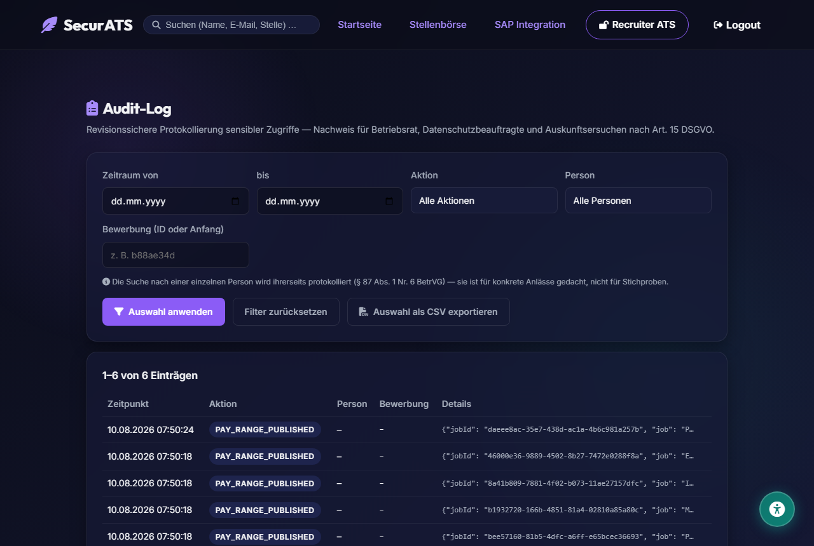

Jede Statusänderung, jede Freigabe, jeder Versand wird protokolliert — und die
Einträge sind kryptografisch verkettet. Wird ein Eintrag nachträglich geändert
oder gelöscht, passt die Kette nicht mehr, und die tägliche Prüfung schlägt
Alarm.

Praktisch heißt das: Auf die Frage „warum wurde diese Person abgelehnt?“ gibt
es eine Antwort, die nicht auf Erinnerung beruht.

## 6.3 Auswertung ohne Namen

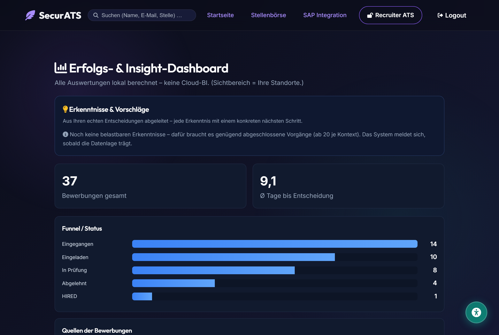

Wie lange dauert eine Besetzung? Wo springen Bewerbende ab? Welche Frage
sortiert überdurchschnittlich viele aus? Die Auswertung beantwortet das auf
Basis Ihrer eigenen Daten — und zeigt nur Zahlen, keine Namen. Wo die
Datenmenge für eine Aussage zu klein ist, sagt sie das, statt Zufall als
Muster auszugeben.

## 6.4 Was Bewerbende sehen dürfen

- **Ihren eigenen Stand** über einen persönlichen Zugangslink, ohne Konto und
  ohne Passwort. Wie das aussieht, steht in 10.4.
- **Ihre Daten** als Datei zum Herunterladen (Art. 15 und 20 DSGVO).
- **Wie KI eingesetzt wird**, auf einer öffentlichen Seite — die beschreibt
  genau die Funktionen, die bei Ihnen aktiv sind, nicht eine Wunschliste.
- **Wie barrierefrei die Seite ist**, in der Barrierefreiheitserklärung, inklusive
  der Punkte, die noch nicht erfüllt sind.

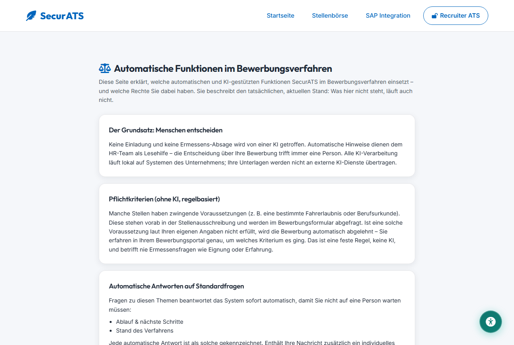

Die KI-Seite wird nicht von Hand gepflegt. Sie liest aus, was bei Ihnen
eingeschaltet ist — schalten Sie die Vorbewertung ab, verschwindet sie auch
dort. Eine Transparenzseite, die man getrennt pflegen muss, ist nach dem
zweiten Umbau falsch.

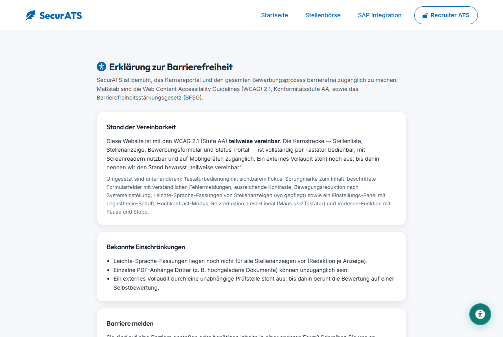

Die Barrierefreiheitserklärung nennt auch, was noch nicht erfüllt ist. Das ist
kein Versehen: Das BFSG verlangt eine ehrliche Angabe, keine Bestnote.

## 6.5 Was das System bewusst nicht tut

- Keine automatische Absage aufgrund einer KI-Einschätzung. Automatische
  Absagen gibt es ausschließlich bei vorher veröffentlichten Pflichtkriterien,
  die regelbasiert geprüft werden — mit Begründung an die bewerbende Person.
- Keine Frage nach dem bisherigen Gehalt.
- Keine Übermittlung von Bewerberdaten an Dienstleister für Versand,
  Kartendienste oder KI.
- Keine Bewertung anhand der Angabe zu einer Schwerbehinderung.

---

# Teil 7 — Die eigene Karriereseite

SecurATS bringt die öffentliche Karriereseite mit. Sie brauchen dafür weder
eine Agentur noch Zugriff auf das Haupt-Internetauftritt Ihres Hauses.

## 7.1 Erscheinungsbild

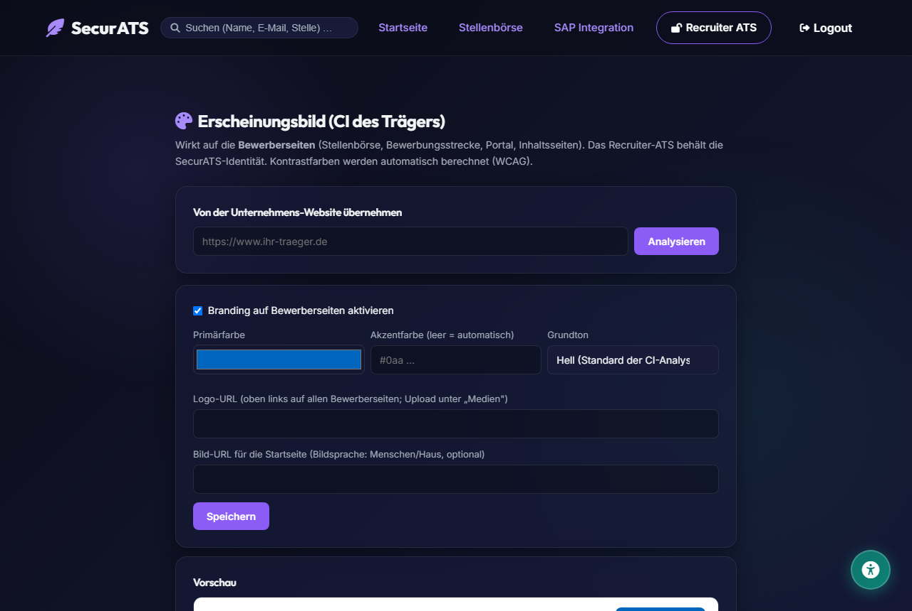

Logo, Hausfarbe und die Wahl zwischen heller und dunkler Darstellung. Die
Vorschau zeigt sofort, wie es wirkt.

**Ein Hinweis zur Lesbarkeit:** Wählen Sie keine zu hellen Farben auf hellem
Grund. Das System prüft den Kontrast nicht für Sie — und schlecht lesbare
Schrift schließt genau die Menschen aus, die Sie erreichen wollen.

## 7.2 Seiten

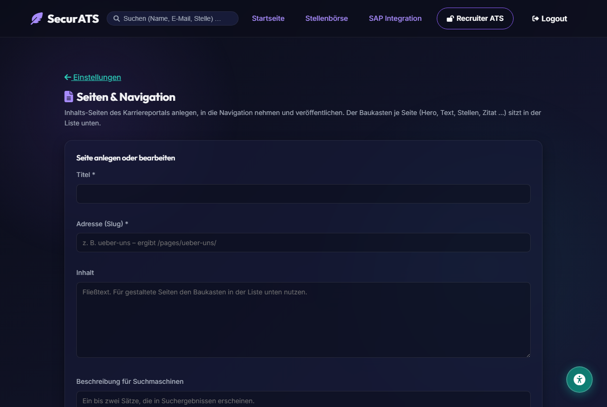

„Über uns“, „Unsere Werte“, „Ausbildung bei uns“: Diese Seiten pflegen Sie
hier. Der Baukasten arbeitet mit Blöcken — Text, Bild, Zitat, Aufzählung —,
die Sie in beliebiger Reihenfolge stapeln.

## 7.3 Mediathek

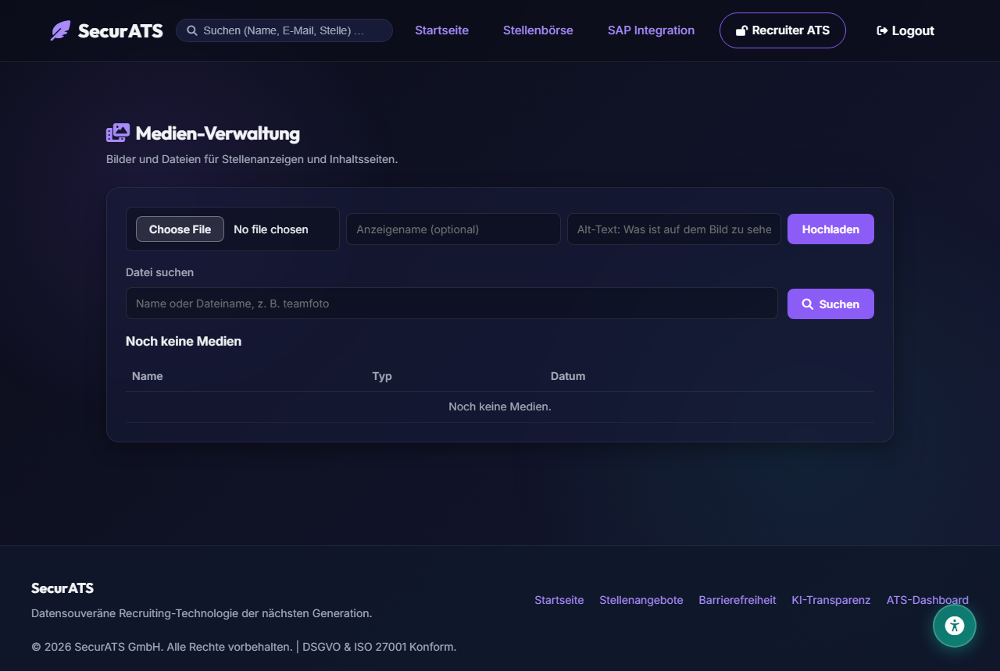

Alle Bilder an einem Ort. **Vergeben Sie zu jedem Bild eine kurze
Beschreibung** — sie wird Menschen vorgelesen, die einen Screenreader nutzen,
und ist bei einer öffentlichen Stelle rechtlich verlangt (BFSG).

Achten Sie außerdem darauf, Fotos von Mitarbeitenden nur mit deren
Einwilligung zu verwenden.

Über der Tabelle steht, welcher Ausschnitt gerade zu sehen ist — etwa
„1–50 von 62 Dateien“. Der Bestand wächst nur, deshalb blättern Sie mit
**„Ältere Dateien“** weiter nach hinten; auch die erste hochgeladene Datei ist
so erreichbar. Wer eine bestimmte Datei sucht, tippt sie ins Feld
**„Datei suchen“** und drückt **„Suchen“**. Gesucht wird in beidem: im
Anzeigenamen und im Dateinamen. Das ist wichtig, sobald beides auseinanderläuft
— aus „IMG_2831.jpg“ wird beim Hochladen gern „Teamfoto Station 3“, und
gefunden werden soll die Datei unter beiden Namen. Ergibt eine Suche nichts,
sagt die Seite es und nennt den Bestand, damit „nichts gefunden“ und „hier ist
nichts“ nicht gleich aussehen; **„Suche zurücksetzen“** bringt Sie zur vollen
Liste zurück.

Wenn Sie eine Datei löschen, kehren Sie auf dieselbe Seite und in dieselbe
Suche zurück — beim Aufräumen fängt man sonst nach jedem Löschen wieder oben an.

## 7.4 Textbausteine

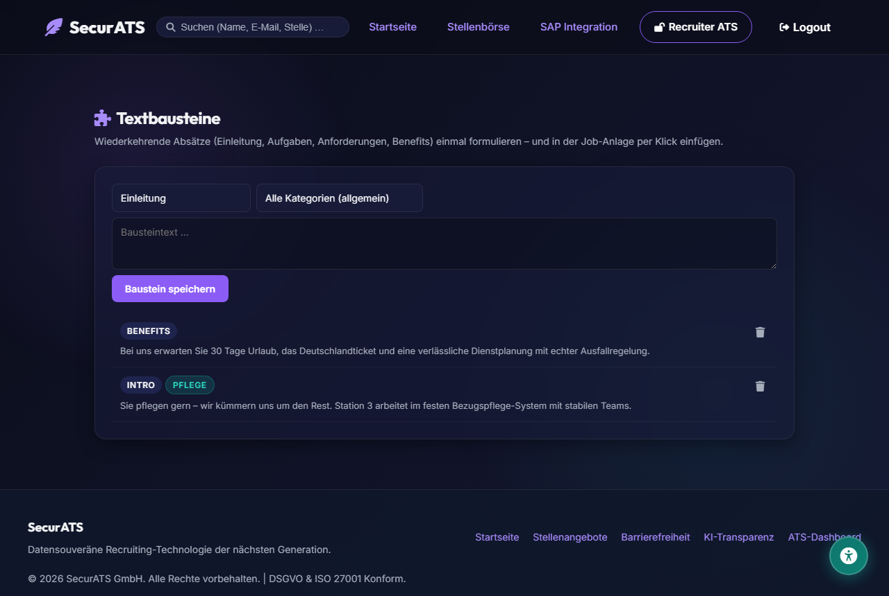

Textteile, die auf mehreren Seiten gleich lauten sollen — etwa Ihre
Benefits-Liste. Einmal geändert, überall aktuell.

## 7.5 Kampagnen-Landingpages

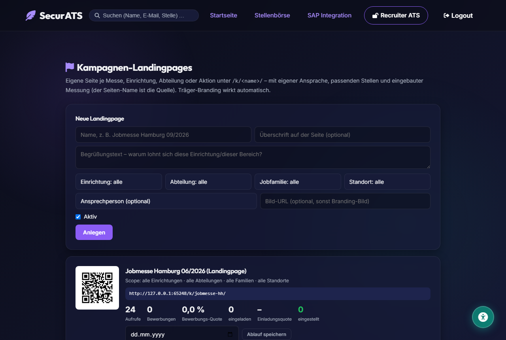

Für eine Messe, eine Anzeigenkampagne oder eine bestimmte Zielgruppe können
Sie eine eigene Seite mit eigener Adresse anlegen. Weil jede Landingpage eine
eigene Adresse hat, sehen Sie in der Auswertung genau, welche Kampagne
Bewerbungen gebracht hat.

---

# Teil 8 — Auswerten und Lernen

## 8.1 Kennzahlen


Die Zahlen, nach denen die Leitung fragt: offene Stellen, Bewerbungen je
Stelle, Dauer bis zur Besetzung, Absagequote. Alles auf Ihren eigenen Daten,
ohne Namen.

## 8.2 Talent-Pool

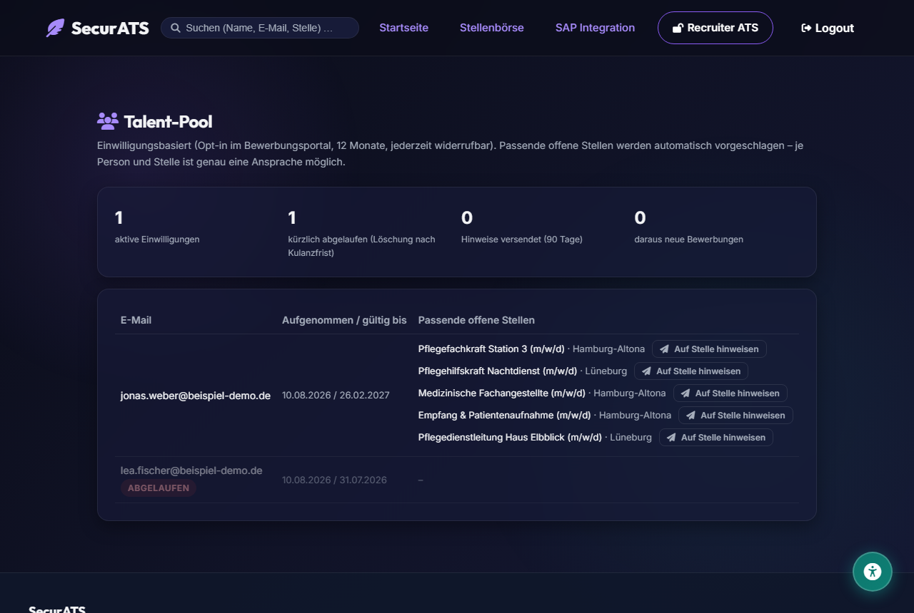

Wer abgelehnt wurde, aber gut war, ist nicht verloren — sofern die Person
ausdrücklich zugestimmt hat, später wieder angesprochen zu werden. Nur diese
Menschen stehen hier.

Bei jeder neuen Stelle zeigt das System passende Treffer aus dem Pool an. So
haben Sie Kandidatinnen und Kandidaten, bevor die Anzeige überhaupt läuft.

**Die Einwilligung läuft ab.** Abgelaufene Einträge werden automatisch
gelöscht — eine Zustimmung von vor drei Jahren trägt keine Ansprache mehr.

## 8.3 Lernendes Scoring

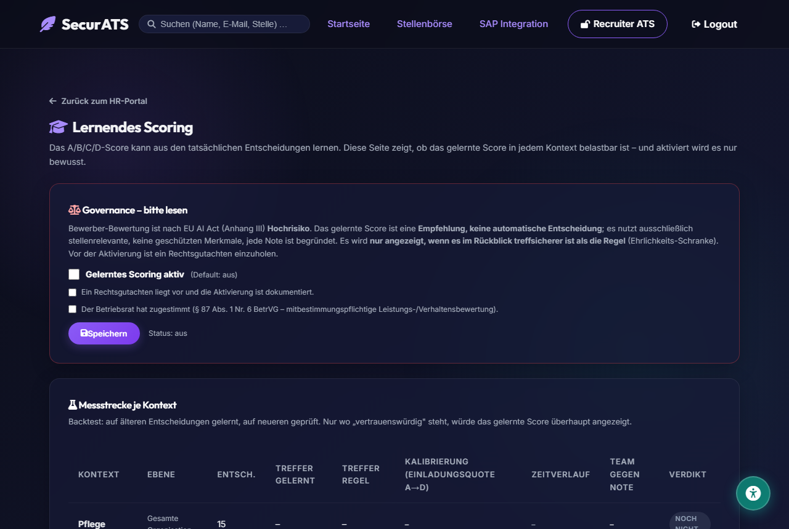

Hiervon sollten Sie wissen, auch wenn Sie es nicht einschalten.

Die Idee: Das System lernt aus Ihren eigenen Entscheidungen, welche Merkmale
in Ihrem Haus zu einer Einladung geführt haben, und leitet daraus eine
Einschätzung ab. Das ist mächtiger als die einfache KI-Vorbewertung — und
genau deshalb strenger eingezäunt:

- **Es ist standardmäßig aus** und läuft erst in einer Messstrecke mit, bevor
  überhaupt etwas angezeigt wird. Sie sehen also erst, ob es bei Ihnen
  funktioniert, bevor es jemand zu sehen bekommt.
- **Ohne Zustimmung des Betriebsrats bleibt es aus.** Ein System, das
  Mitarbeitendenverhalten auswertet, ist mitbestimmungspflichtig (§ 87 Abs. 1
  Nr. 6 BetrVG). Das ist keine Höflichkeit, sondern eine technische Sperre.
- **Es warnt vor sich selbst.** Weicht das Modell zunehmend von den
  menschlichen Entscheidungen ab, wird das gemeldet — statt still weiter
  Empfehlungen auszugeben.

**Was Sie bedenken sollten:** Ein System, das aus vergangenen Entscheidungen
lernt, lernt auch vergangene Einseitigkeiten. Wenn in Ihrem Haus bisher
überwiegend ein bestimmtes Profil eingeladen wurde, wird das Modell genau das
für richtig halten. Die Einschätzung bleibt deshalb immer eine Lesehilfe, und
die Messstrecke ist dazu da, solche Muster zu erkennen, bevor sie wirken.

## 8.4 Vergleichsprofile („Wissensdatenbank“)

In der KI-Zentrale gibt es einen dritten Block, der leicht übersehen wird und
Erklärung verdient: Sie können **anonymisierte Lebensläufe besonders geeigneter
Mitarbeitender** hochladen. Die lokale KI erzeugt daraus ein mathematisches
Profil, und neue Bewerbungen werden damit inhaltlich verglichen.

So funktioniert es technisch:

- Aus jedem PDF wird ein **Vektor** berechnet — eine Zahlenreihe, die den
  Inhalt zusammenfasst. **Der Lebenslauf selbst wird nicht gespeichert**, und
  aus dem Vektor lässt er sich nicht zurückrechnen.
- Ist die lokale KI nicht erreichbar, entsteht **nichts**. Es gibt keinen
  Fortschrittsbalken, der Erfolg vortäuscht.
- Alles bleibt auf Ihrem Server.

**Und jetzt das Wichtige — überlegen Sie zweimal, bevor Sie das nutzen:**

- Die Lebensläufe gehören realen Mitarbeitenden. Anonymisieren allein genügt
  oft nicht; holen Sie deren Einwilligung ein, und beziehen Sie den
  Betriebsrat ein.
- „Wer ist ein Best Performer?“ ist eine Wertung, keine Messung. Wer die
  bisherige Belegschaft zum Maßstab macht, schreibt deren Zusammensetzung
  fort — das kann eine mittelbare Benachteiligung im Sinne des AGG sein.
- Nutzen Sie es, wenn überhaupt, für **fachliche Ähnlichkeit** (welche
  Tätigkeiten, welche Qualifikationen) und nie als Ersatz für das Anschauen
  einer Bewerbung.

Wenn Sie das nicht sicher beurteilen können: Lassen Sie den Block leer. Die
Plattform funktioniert vollständig ohne ihn.

---

# Teil 9 — Anbindung an andere Systeme

Dieser Teil richtet sich an die IT.

## 9.1 Übergabe an das Personalsystem

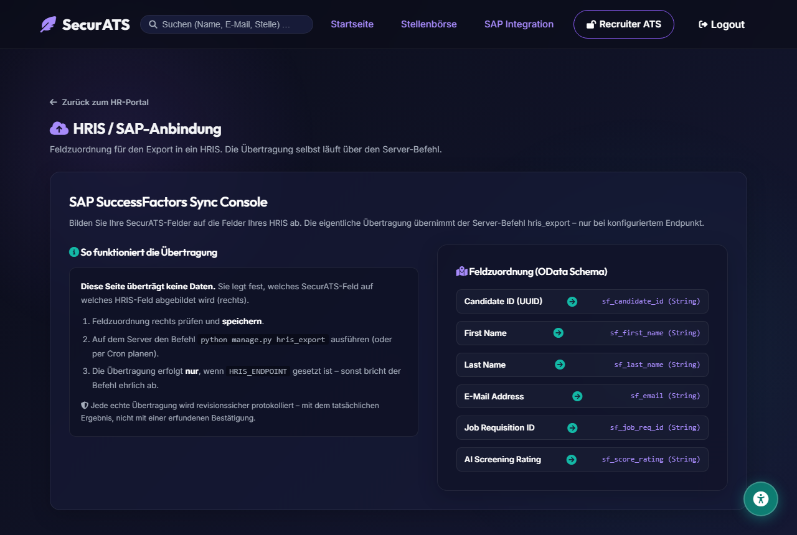

Steht eine Einstellung fest, lassen sich die Daten strukturiert an das
Personalsystem übergeben, statt sie abzutippen.

## 9.2 SAP SuccessFactors

Eine eigene Seite bildet die Felder beider Systeme aufeinander ab. Sie legen
dort einmal fest, welches Feld bei Ihnen welchem Feld drüben entspricht.

## 9.3 Stellenbörsen

SecurATS liefert Ihre Stellen als Datenstrom für Jobbörsen und die
Bundesagentur für Arbeit. Diese Zugänge sind mit einem Schlüssel geschützt —
**ist keiner gesetzt, sind die Datenströme offen erreichbar.** Bitte prüfen
Sie das bei der Einrichtung.

---

# Teil 10 — Was Bewerbende sehen

Es hilft, die andere Seite zu kennen — auch, um Rückfragen zu verstehen.

## 10.1 Die Karriereseite

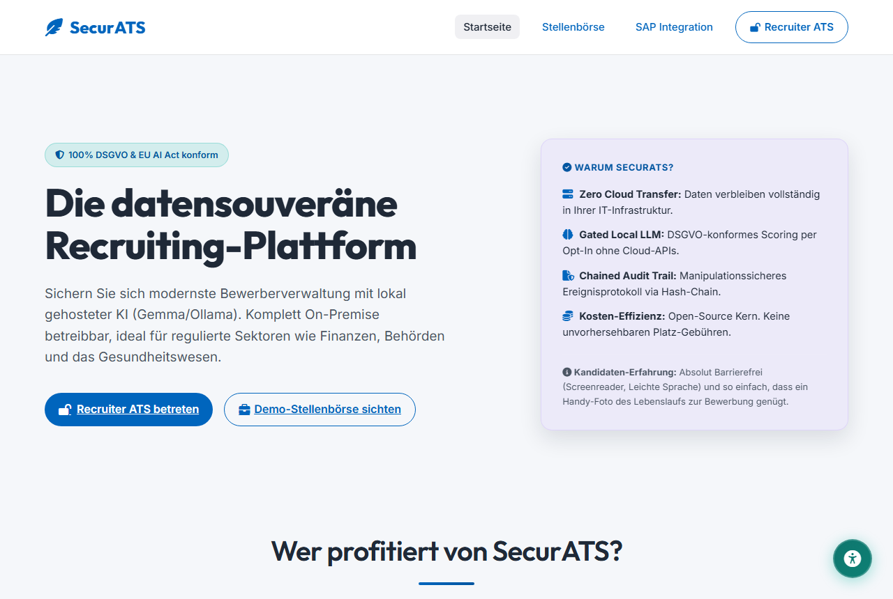

Die Karriereseite ist die Startseite. Was dort steht, pflegen Sie in Teil 7.

## 10.2 Die Stellenliste

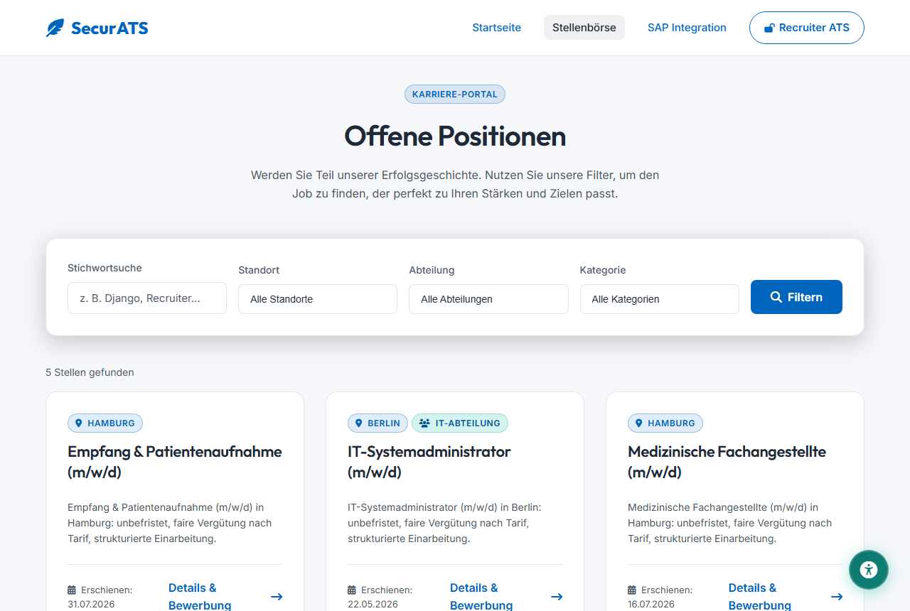

Sie zeigt alle veröffentlichten Stellen, mit Filtern nach Ort, Bereich und
Umfang. Jede Anzeige nennt die Gehaltsspanne — das ist keine Einstellung,
sondern Pflicht.

## 10.3 Benachrichtigungen über neue Stellen

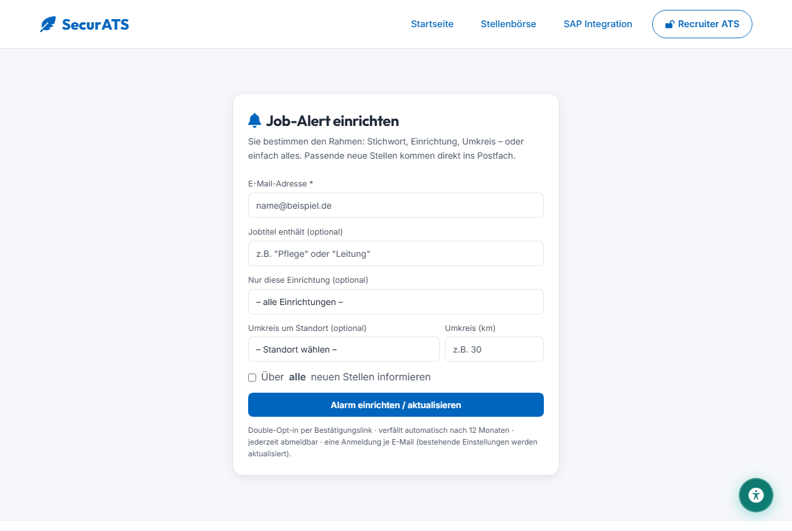

Wer noch nichts Passendes findet, hinterlässt seine Adresse und wird bei neuen
Stellen benachrichtigt. Die Anmeldung wird per E-Mail bestätigt
(Double-Opt-in), und jede Nachricht enthält einen Abmelde-Link.

## 10.4 Nach der Bewerbung

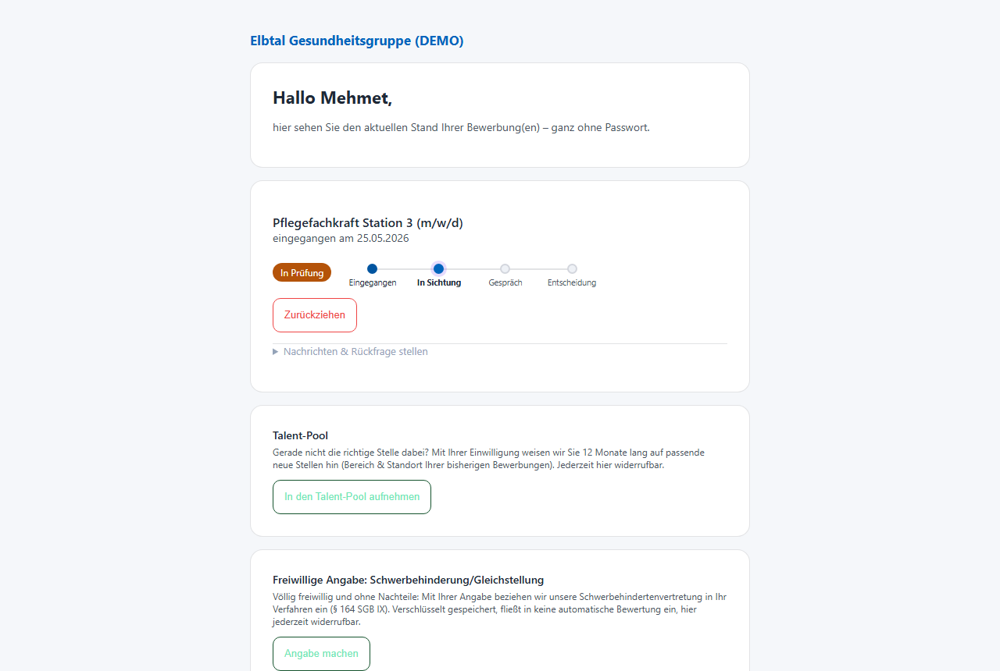

Die Person bekommt einen persönlichen Link. Darüber sieht sie ihren Stand,
bucht Gesprächstermine selbst, kann Nachrichten schreiben, ihre Daten
herunterladen und die Bewerbung zurückziehen — ohne Konto und ohne Passwort.
